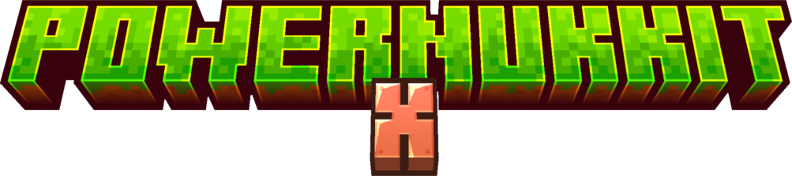

import { CpuIcon, SettingsIcon, PuzzleIcon, ShieldIcon, UsersIcon, GitBranchIcon, HelpCircleIcon, BookOpenIcon, StarIcon } from "lucide-react";
import { Card, Cards } from "fumadocs-ui/components/card";
import { Callout } from "fumadocs-ui/components/callout";

## About PowerNukkitX

PowerNukkitX is an open-source, modern, and performance-focused server software for Minecraft Bedrock Edition.
It is built on Nukkit but enhanced with numerous optimizations, advanced plugin support, and improved stability to meet the needs of both small private servers and large public networks.

Whether you are a developer, server administrator, or community manager, PowerNukkitX gives you full control over your server environment while keeping things fast, secure, and reliable.

<Callout type="info" icon={<HelpCircleIcon />}>
    PowerNukkitX is fully open source and actively maintained by its community.
    You can contribute, report bugs, or request features at our
    <a href="https://github.com/PowerNukkitX/PowerNukkitX" target="_blank" className="underline">GitHub</a> repository or join the discussion on
    <a href="https://discord.gg/pnx" target="_blank" className="underline">Discord</a>.
</Callout>

### Why PowerNukkitX?

PowerNukkitX is more than just a Minecraft Bedrock server software. It is a
modern and
performance-focused platform designed for server administrators and developers.

Built on top of Nukkit, PowerNukkitX provides a
reliable and
flexible foundation for both small servers and large networks.

Below are the key reasons why PowerNukkitX is a
strong choice for Minecraft Bedrock servers:

<Cards>
    <Card icon={<CpuIcon className="text-primary" />} title="High Performance">
        PowerNukkitX is built to handle large worlds and high player counts efficiently. Its optimized architecture reduces CPU and memory usage, ensuring stable performance even under heavy load.
    </Card>

    <Card icon={<PuzzleIcon className="text-primary" />} title="Powerful Plugin System">
        A flexible and developer-friendly plugin system allows you to extend server behavior, automate tasks, and create custom gameplay features tailored to your community.
    </Card>

    <Card icon={<ShieldIcon className="text-primary" />} title="Security & Stability">
        With advanced permission management, regular updates, and strict stability goals, PowerNukkitX prioritizes server safety and long-term reliability.
    </Card>

    <Card icon={<SettingsIcon className="text-primary" />} title="Wide Compatibility">
        PowerNukkitX supports the latest Minecraft Bedrock versions and runs seamlessly on Windows, Linux, and macOS, making it suitable for a wide range of hosting environments.
    </Card>

    <Card icon={<BookOpenIcon className="text-primary" />} title="Clear Documentation">
        Well-structured documentation, API references, and community-driven tutorials help both beginners and experienced developers get started quickly.
    </Card>

    <Card icon={<UsersIcon className="text-primary" />} title="Active Community">
        As an open-source project, PowerNukkitX benefits from active development and a welcoming community that shares knowledge, support, and feedback.
    </Card>

    <Card icon={<StarIcon className="text-primary" />} title="Deep Customization">
        From server settings to custom plugins, PowerNukkitX offers extensive configuration options, giving you full control over gameplay and server behavior.
    </Card>

    <Card icon={<GitBranchIcon className="text-primary" />} title="Growing Ecosystem">
        PowerNukkitX integrates with external tools, APIs, and an expanding ecosystem of extensions, making it easy to build advanced and scalable server setups.
    </Card>
</Cards>

<Callout type="info" icon={<GitBranchIcon />}>
    <b>How to contribute?</b> 
    PowerNukkitX is open source and community-driven. Join us on
    <a href="https://github.com/PowerNukkitX/PowerNukkitX" target="_blank" className="underline">GitHub</a> or
    <a href="https://discord.gg/pnx" target="_blank" className="underline">Discord</a>
    to report issues, suggest features, or contribute code and documentation.
</Callout>

---

### Quick Start

Get your PowerNukkitX server up and running in just a few steps. Follow these guides to install, configure, and extend your server while keeping it secure and optimized.

<Cards>
    <Card icon={<CpuIcon className="text-primary" />} title="Install PowerNukkitX" href="/docs/installation">
        Download the server, run your first instance, and verify everything works smoothly.
    </Card>

    <Card icon={<SettingsIcon className="text-primary" />} title="Configure your server" href="/docs/configuration">
        Learn to tune performance, manage worlds and network settings, and apply recommended defaults.
    </Card>

    <Card icon={<PuzzleIcon className="text-primary" />} title="Develop plugins" href="/docs/development/basics">
        Create your first plugin, understand its lifecycle, and follow best practices for maintainable code.
    </Card>

    <Card icon={<ShieldIcon className="text-primary" />} title="Permissions & security" href="/docs/permissions">
        Keep your server safe with roles, permissions, and least privilege principles.
    </Card>
</Cards>

---

## Supported Platforms & Versions

PowerNukkitX runs on all major platforms:

- Windows
- Linux
- macOS

It supports the latest Minecraft Bedrock Edition releases and is regularly updated to ensure compatibility with new game features and fixes.
