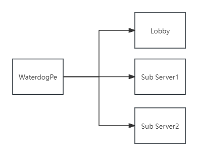

Using a network proxy allows you to seamlessly transfer players between multiple sub-servers (e.g. Lobby, Survival, Creative) without disconnecting them from the network.



PowerNukkitX natively supports the [WaterdogPE](https://github.com/WaterdogPE/WaterdogPE) proxy, enabling IP forwarding and session transfer.

## Setting Up WaterdogPE Support

To enable proxy support on your PowerNukkitX sub-servers:

### 1. Enable WaterdogPE and Disable Xbox Auth in pnx.yml

> [!WARNING]
> Remember to **shut down the server** before modifying `pnx.yml` to prevent the server from overwriting your edits with cached configurations on shutdown.

On each sub-server, open the `pnx.yml` configuration file, locate the `baseSettings` section, and set `waterdogpe` to `true` and `xboxAuth` to `false` (since the proxy handles player authentication, sub-servers must not attempt to re-authenticate connections with Xbox Live):

```yaml filename="pnx.yml"
baseSettings:
  waterdogpe: true
  xboxAuth: false
```

### 2. Configure Your Proxy
Configure your WaterdogPE proxy's `config.yml` file to register your sub-servers with their respective IP addresses and UDP ports. Ensure the proxy's IP forwarding mode matches your sub-server expectations.

### 3. Restart Sub-Servers
Restart each sub-server to apply the proxy configurations.

> [!IMPORTANT]
> When transferring players between servers programmatically or via commands, ensure all container inventories (like chests or custom UI forms) are closed for the player beforehand. Failing to close inventories may cause sync issues on the destination server.
